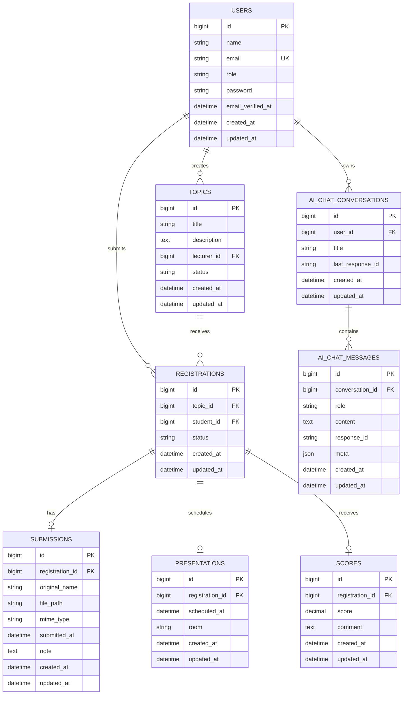

# Database Guide

This document explains the database structure of the Seminar Manager project so the data flow is easy to understand before reading the code.

## Overview

The application is centered around one seminar workflow:

1. A lecturer creates a topic.
2. A student registers for that topic.
3. The lecturer approves or rejects the registration.
4. The student uploads a report submission.
5. The lecturer schedules the presentation.
6. The lecturer publishes a score and comment.

Because of that workflow, the most important table is `registrations`. It connects a `student` to a `topic`, and every later step hangs off that registration.

## Main Tables

### `users`

Stores all authenticated accounts in the system.

Key columns:

- `id`: primary key
- `name`: full name
- `email`: unique login email
- `role`: application role, usually `admin`, `lecturer`, or `student`
- `password`: hashed password
- `email_verified_at`: optional verification timestamp
- `remember_token`: login persistence token
- `created_at`, `updated_at`: Laravel timestamps

How it is used:

- `admin` manages users and can manage all data
- `lecturer` owns topics and reviews student work
- `student` registers for topics and uploads reports

### `topics`

Stores seminar topics created by lecturers.

Key columns:

- `id`: primary key
- `title`: topic title
- `description`: topic details
- `lecturer_id`: foreign key to `users.id`
- `status`: topic state, currently defaults to `open`
- `created_at`, `updated_at`

Meaning:

- One lecturer can create many topics
- One topic can receive many student registrations

### `registrations`

Stores a student's registration for a topic.

Key columns:

- `id`: primary key
- `topic_id`: foreign key to `topics.id`
- `student_id`: foreign key to `users.id`
- `status`: registration state, defaults to `pending`
- `created_at`, `updated_at`

Important rule:

- `unique(topic_id, student_id)` prevents the same student from registering for the same topic more than once

Meaning:

- One topic has many registrations
- One student has many registrations
- One registration may later have one submission, one presentation, and one score

### `submissions`

Stores the uploaded report file for a registration.

Key columns:

- `id`: primary key
- `registration_id`: unique foreign key to `registrations.id`
- `original_name`: original uploaded filename
- `file_path`: saved storage path
- `mime_type`: file MIME type
- `submitted_at`: report submission time
- `note`: optional note from the student
- `created_at`, `updated_at`

Meaning:

- Each registration can have at most one current uploaded report

### `presentations`

Stores the defense/presentation schedule for an approved registration.

Key columns:

- `id`: primary key
- `registration_id`: unique foreign key to `registrations.id`
- `scheduled_at`: scheduled datetime
- `room`: room or venue
- `created_at`, `updated_at`

Meaning:

- Each registration can have at most one presentation schedule

### `scores`

Stores the final evaluation for a registration.

Key columns:

- `id`: primary key
- `registration_id`: unique foreign key to `registrations.id`
- `score`: numeric score, stored as `decimal(4,2)`
- `comment`: lecturer feedback
- `created_at`, `updated_at`

Meaning:

- Each registration can have at most one final score record

### `ai_chat_conversations`

Stores saved AI chat sessions for each authenticated user.

Key columns:

- `id`: primary key
- `user_id`: foreign key to `users.id`
- `title`: short label for the conversation
- `last_response_id`: last AI provider response id for continuing context
- `created_at`, `updated_at`

Meaning:

- One user can have many saved AI chat conversations

### `ai_chat_messages`

Stores the messages inside each saved AI chat conversation.

Key columns:

- `id`: primary key
- `conversation_id`: foreign key to `ai_chat_conversations.id`
- `role`: message sender, such as `user` or `assistant`
- `content`: message body
- `response_id`: optional AI provider response id
- `meta`: optional structured metadata such as model info
- `created_at`, `updated_at`

Meaning:

- One conversation can have many messages
- Together, these tables provide AI chat persistence

## Supporting Laravel Tables

These tables come from the standard Laravel setup and support framework features:

### `password_reset_tokens`

- Password reset data keyed by email

### `sessions`

- Database session storage for authenticated sessions

### `cache`

- Laravel cache storage

### `cache_locks`

- Cache lock support

### `jobs`

- Queued job records

### `job_batches`

- Batched job metadata

### `failed_jobs`

- Failed queued job records

For seminar understanding, these are less important than `users`, `topics`, `registrations`, `submissions`, `presentations`, and `scores`.
The AI module adds `ai_chat_conversations` and `ai_chat_messages`, which are important for the assistant feature.

## Relationship Map

```text
users
  |- hasMany topics           via lecturer_id
  |- hasMany registrations    via student_id

topics
  |- belongsTo users          as lecturer
  |- hasMany registrations

registrations
  |- belongsTo topics
  |- belongsTo users          as student
  |- hasOne submissions
  |- hasOne presentations
  |- hasOne scores

submissions
  |- belongsTo registrations

presentations
  |- belongsTo registrations

scores
  |- belongsTo registrations

ai_chat_conversations
  |- belongsTo users
  |- hasMany ai_chat_messages

ai_chat_messages
  |- belongsTo ai_chat_conversations
```

## ERD Diagram



## Core Data Flow

### 1. Lecturer creates a topic

- A new row is inserted into `topics`
- `lecturer_id` points to the lecturer account in `users`

### 2. Student registers for a topic

- A new row is inserted into `registrations`
- It links one `student_id` and one `topic_id`
- Initial status is `pending`

### 3. Lecturer reviews the registration

- The `status` field in `registrations` is updated
- Common states in the current app are:
  - `pending`
  - `approved`
  - `rejected`

### 4. Student uploads a report

- A row is created in `submissions`
- It is linked to the registration through `registration_id`
- Since `registration_id` is unique, only one active submission exists per registration

### 5. Lecturer schedules the presentation

- A row is created in `presentations`
- It stores date/time and room information

### 6. Lecturer gives a score

- A row is created in `scores`
- Final numeric score and comment are stored there

## Why `registrations` Is the Center Table

If you want to understand the whole app, focus on `registrations`.

It acts like the business-process table:

- It tells you which student joined which topic
- It stores approval status
- It connects to submission data
- It connects to scheduling data
- It connects to grading data

So in practice:

- `topic` = what the seminar is about
- `registration` = who joined
- `submission` = what file they submitted
- `presentation` = when they present
- `score` = how they were evaluated

## Example Query Ideas

### Get all topics with lecturer names

```sql
SELECT topics.title, users.name AS lecturer_name, topics.status
FROM topics
JOIN users ON users.id = topics.lecturer_id;
```

### Get all registrations for one student

```sql
SELECT registrations.id, topics.title, registrations.status
FROM registrations
JOIN topics ON topics.id = registrations.topic_id
WHERE registrations.student_id = 4;
```

### Get the full seminar pipeline for one registration

```sql
SELECT
    registrations.id,
    registrations.status,
    submissions.original_name,
    presentations.scheduled_at,
    presentations.room,
    scores.score,
    scores.comment
FROM registrations
LEFT JOIN submissions ON submissions.registration_id = registrations.id
LEFT JOIN presentations ON presentations.registration_id = registrations.id
LEFT JOIN scores ON scores.registration_id = registrations.id
WHERE registrations.id = 1;
```

## Eloquent Model Mapping

The database structure maps directly to these models:

- `App\Models\AiChatConversation`
- `App\Models\AiChatMessage`
- `App\Models\User`
- `App\Models\Topic`
- `App\Models\Registration`
- `App\Models\Submission`
- `App\Models\Presentation`
- `App\Models\Score`

If you want to understand the code side after this document, read these models first, then the controllers.

## Quick Summary

If you remember only one sentence, remember this:

The Seminar Manager database is built around `registrations`, which connect students to topics and then extend into submission, scheduling, and scoring.
